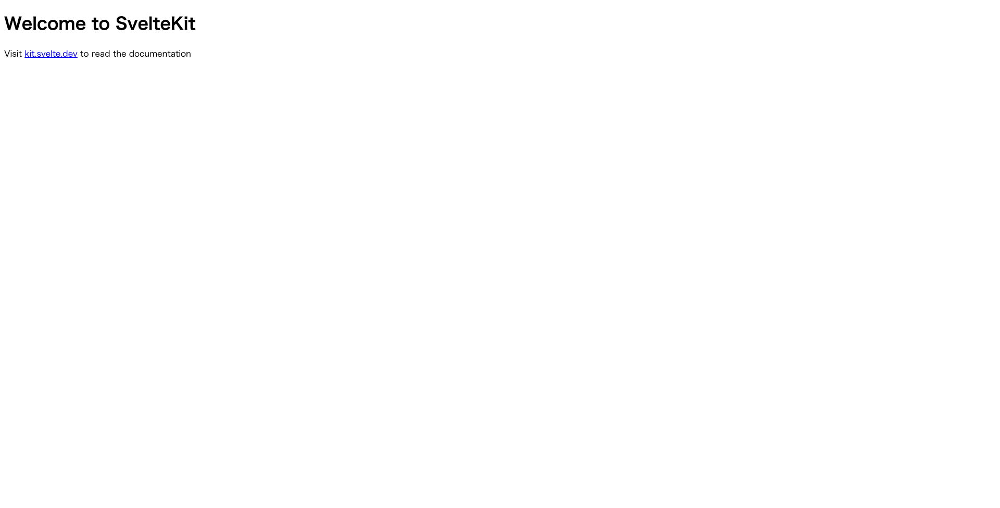

# Sveltekitを用いたアプリケーション

## プロジェクト構成

プロジェクトの構成は以下の通りです。

```bash
.
├── Dockerfile
├── README.md
├── docker-compose.yml
├── node_modules
├── package-lock.json
├── package.json
├── src
├── static
├── svelte.config.js
├── tsconfig.json
└── vite.config.ts

```

## 起動方法

### 1. コンテナのビルド

```bash
$ docker compose build
```

### 2. コンテナの起動

```bash
$ docker compose up -d
```

-d: バックグラウンドで起動

※ コンテナのビルドと起動は以下のコマンドで同時に行うこともできます。

```bash
$ docker compose up -d --build
```

### 3. コンテナが起動していることを確認

```bash
$ docker compose ps
```

以下のように表示されれば OK です。

```bash
NAME                IMAGE               COMMAND                  SERVICE             CREATED             STATUS              PORTS
frontend-web-1      frontend-web        "docker-entrypoint.s…"   web                 36 seconds ago      Up 25 seconds       0.0.0.0:5173->5173/tcp, :::5173->5173/tcp
```

アプリケーションが起動したら、以下の URL にアクセスしてみてください。

```bash
http://localhost:5173
```

ブラウザに以下のような画面が表示されれば OK です。


### コンテナの停止

```bash
$ docker compose down
```

以下のように表示されれば OK です。

```bash
[+] Running 2/2
 ✔ Container frontend-web-1  Removed
 ✔ Network frontend_default  Removed
```
